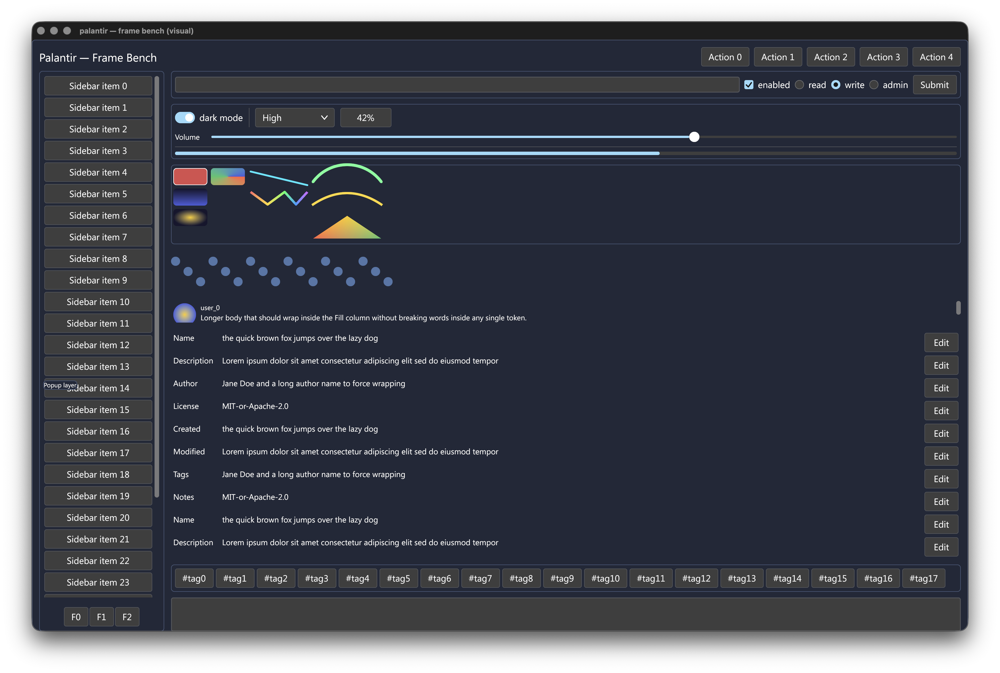
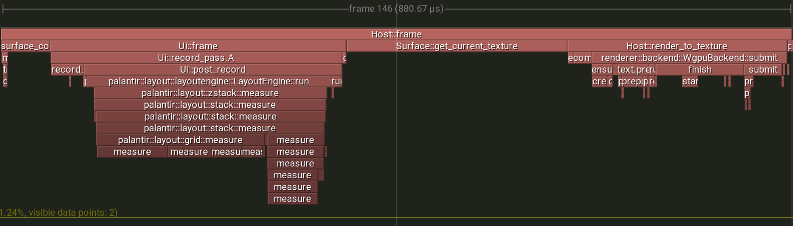
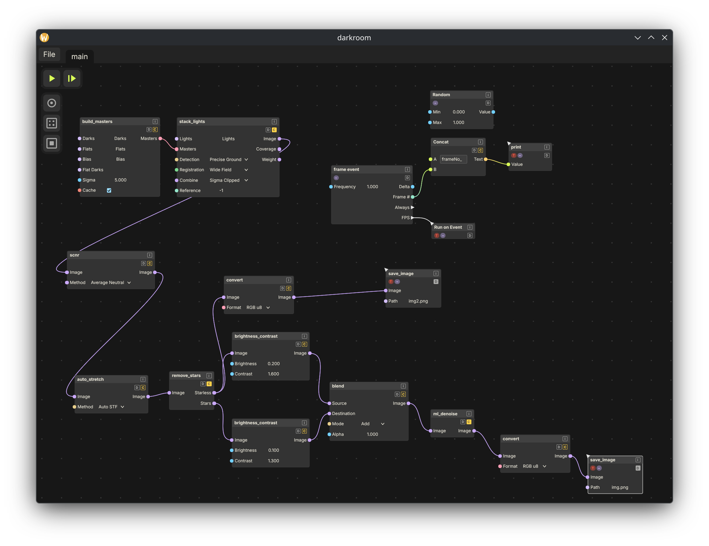

<p align="center">
  
</p>

<h1 align="center">Aperture</h1>

<p align="center">
  An immediate-mode GUI library for Rust — WPF-style two-pass layout, wgpu renderer.
</p>

Status: **beta** — feature-rich and usable, but still pre-1.0: the public
API can still change and break between releases.



Worst-case frame timing captured while resizing the window on a MacBook Air M5.



Steady-state cost per frame on `frame/cached_cpu` (AMD Ryzen 7 6800U,
Zen3+, clock locked at 2.4 GHz, ~332 µs/frame): **~2.55 M instructions
retired**, **~785 K cycles**, **IPC ≈ 3.25**. The frame is
retiring-bound, not stalled: **branch mispredicts are 0.18%** of ~365 K
branches (~0.26 per 1K instructions) and the **L1-d cache miss rate is
2.9%** of ~913 K loads (~10 per 1K instructions), with only 3.3% of
cycles lost to a frontend stall. Measured via `perf stat -d`, pinned to
one core.

---

A short screen recording of the [showcase](src/bin/showcase) tabs:

https://github.com/user-attachments/assets/73fd7143-087c-4895-a033-7644b184537f

---

[Darkroom app](https://github.com/xorza/Darkroom)


## Highlights

- **Immediate-mode authoring**, builder-style widgets that read like prose.
- **WPF-contract two-pass layout** (measure → arrange) with flex-shrink
  sizing and a min-content floor.
- **wgpu rendering** with premultiplied-alpha linear-RGB throughout;
  sRGB encode happens on the swapchain.
- **Layered recording** — `Main` / `Popup` / `Modal` / `Tooltip` / `Debug`
  arenas painted bottom-up, hit-tested top-down.
- **Cross-frame work-skip cache** keyed on `(WidgetId, subtree_hash,
available_q)`; subtree hits blit last frame's measure result and skip
  recursion.
- **In-house text backend** on top of `cosmic-text` so the GPU upload
  path routes through aperture's staging belt.
- **`GpuView` — raw `wgpu` inside a widget.** Implement `GpuPaint` on your
  own renderer (a 3D scene, a custom shader) and hand it to
  `GpuView::new(paint)`; the framework owns an off-screen target sized to the
  widget's rect, runs your callback into it, and composites the result through
  the image pipeline — so it clips, rounds, and z-orders like any other widget.
  Mark a static view `.repaint(false)` and it goes undamaged (its paint is
  skipped) until something changes.

## Not yet implemented

Pre-1.0 — these are known gaps, not design rejections:

- **Accessibility** — no AccessKit / screen-reader support yet.
- **Italic + app-facing font loading** — text shapes in Regular or **Bold**
  (weight is wired through to shaping and rasterization), but there's no
  italic / oblique axis, and only the two bundled families (Inter, JetBrains
  Mono) exist — no arbitrary font registration yet.
- **Tab-key focus traversal** — focus exists (click-to-focus, programmatic
  `request_focus`), but `Tab` / `Shift+Tab` cycling does not.
- **Virtualized list / table** — `Scroll` records all children; no
  row-virtualized list or data table for large datasets.
- **Rich text** — one family / size / colour per `Text`; no inline spans.
- **SVG** — no SVG rendering (`Mesh` is the raw vector escape hatch).
- **RTL / bidirectional text** — right-to-left and mixed-direction scripts
  aren't supported yet.

## Zero per-frame allocation

Steady-state frames are heap-alloc-free after warmup. Per-frame data lives
on retained scratch (`RecordStore`, SoA columns on `Tree`, `CacheArena`)
that reuses capacity across frames; any new per-frame `Vec::new()` /
`HashMap` rebuild is treated as a regression and caught by the
`alloc_free` / `alloc_free_gpu` benches under `benches/`.

## Example

```rust
use aperture::{
    App, Button, Configure, Panel, Sizing, Text, Ui, WindowToken, WinitHost, WinitHostConfig,
};

struct Counter { clicks: u32 }

impl App for Counter {
    // `win` names which window is being drawn; switch on it for multi-window
    // apps. This one has a single window, so it's ignored.
    fn frame(&mut self, _win: WindowToken, ui: &mut Ui) {
        Panel::vstack()
            .auto_id()
            .gap(8.0)
            .size((Sizing::Hug, Sizing::Hug))
            .show(ui, |ui| {
                Text::new(format!("clicks: {}", self.clicks)).auto_id().show(ui);
                if Button::new().label("click me").show(ui).clicked() {
                    self.clicks += 1;
                }
            });
    }
}

fn main() {
    // `new` takes the first window's token + config and a builder that
    // constructs the app once its `Ui` and host handle are live.
    WinitHost::new(WindowToken(0), WinitHostConfig::new("counter"), |_ui, _host| {
        Counter { clicks: 0 }
    })
    .run();
}
```

Run the bundled [showcase](src/bin/showcase) for a tour of every widget:

```sh
cargo run --release
```

To author your own widget from the public API, see
[`examples/custom_widget.rs`](examples/custom_widget.rs) — a `Stepper`
built from `Element` + `Configure`, `Ui::widget_id` / `Ui::node` /
`Ui::add_shape` / `Ui::response_for`, with nothing reaching into crate
internals:

```sh
cargo run --example custom_widget
```

## License

Aperture is dual-licensed:

- **Open source / non-commercial use** — [GPL-3.0-or-later](LICENSE).
  Free to use, modify, and redistribute, provided your combined work is also
  released under GPL-3.0-or-later with complete corresponding source.

- **Commercial use** — see [LICENSE-COMMERCIAL.md](LICENSE-COMMERCIAL.md).
  If you want to ship Aperture as part of a proprietary, closed-source
  product, contact xxorza@gmail.com for a commercial license.

## Contributing

See [CONTRIBUTING.md](CONTRIBUTING.md). All contributions are accepted
under the [Contributor License Agreement](CLA.md), which preserves the
dual-license model by granting the maintainer the right to relicense
contributions (including commercially).
